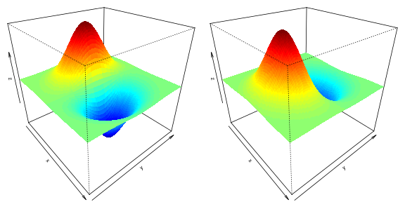

There is a great RcppArmadillo
[implementation](http://gallery.rcpp.org/articles/dmvnorm_arma/) of
multivariate normal densities. But I was looking for the first derivative of
the multivariate normal densities. Good implementations are surprisingly hard
to come by. I wasn't able to find any online and my first R implementations
were pretty slow. RcppArmadillo might be a great alternative particularly
because I am not aware of any c or Fortran implementations in R. In these
areas, we can expect the largest performance gains. Indeed, the RcppArmadillo
version is over 400-times faster than the R implementation!

First, let's take a look at the density function
$$ x \sim N(m,\Sigma) $$
as shown in the *The Matrix Cookbook* (Nov 15, 2012 version) formula 346 and 347 

$$
\frac{\partial p(\mathbf{x})}{\partial\mathbf{x}}=-\frac{1}{\sqrt{det(2\pi\mathbf{\Sigma})}}exp\left[-\frac{1}{2}(\mathbf{x}-\mathbf{m})^{T}\mathbf{\Sigma}^{-1}(\mathbf{x}-\mathbf{m})\right]\mathbf{\Sigma}^{-1}(\mathbf{x}-\mathbf{m}) 
$$

where $$\mathbf{x}$$ and $$\mathbf{m}$$ are d-dimensional and $$\mathbf{\Sigma}$$ is a $$d \times d$$ variance-covariance matrix.

Now we can start with a R implementation of the first derivative of the multivariate normal distribution. First, let's load some R packages:


library('RcppArmadillo')
library('mvtnorm')
library('rbenchmark')
library('fields')


Here are two implementations. One is pure R and one is based on `dmvnorm` in the `mvtnorm` package.


dmvnorm_deriv1 <- function(X, mu=rep(0,ncol(X)), sigma=diag(ncol(X))) {
    fn <- function(x) -1 * c((1/sqrt(det(2*pi*sigma))) * exp(-0.5*t(x-mu)%*%solve(sigma)%*%(x-mu))) * solve(sigma,(x-mu))
    out <- t(apply(X,1,fn))
    return(out)
}
dmvnorm_deriv2 <- function(X, mean, sigma) {
    if (is.vector(X)) X <- matrix(X, ncol = length(X))
    if (missing(mean)) mean <- rep(0, length = ncol(X))
    if (missing(sigma)) sigma <- diag(ncol(X))
    n <- nrow(X)
    mvnorm <- dmvnorm(X, mean = mean, sigma = sigma)
    deriv <- array(NA,c(n,ncol(X)))
    for (i in 1:n)
        deriv[i,] <- -mvnorm[i] * solve(sigma,(X[i,]-mean))
    return(deriv)
}


These implementations work but they are not very fast. So let's look at a RcppArmadillo version.
The `Mahalanobis` function and the first part of `dmvnorm_deriv_arma` are based on [this](http://gallery.rcpp.org/articles/dmvnorm_arma/)
gallery example, which implements a fast multivariate normal density with RcppArmadillo.


#include <RcppArmadillo.h>

// [[Rcpp::depends(RcppArmadillo)]]
// [[Rcpp::export]]
arma::vec Mahalanobis(arma::mat x, arma::rowvec center, arma::mat cov){
    int n = x.n_rows;
    arma::mat x_cen;
    x_cen.copy_size(x);
    for (int i=0; i < n; i++) {
        x_cen.row(i) = x.row(i) - center;
    }
    return sum((x_cen * cov.i()) % x_cen, 1);
}

// [[Rcpp::export]]
arma::mat dmvnorm_deriv_arma(arma::mat x, arma::rowvec mean, arma::mat sigma) {
    // get result for mv normal
    arma::vec distval = Mahalanobis(x,  mean, sigma);
    double logdet = sum(arma::log(arma::eig_sym(sigma)));
    double log2pi = std::log(2.0 * M_PI);
    arma::vec mvnorm = exp(-( (x.n_cols * log2pi + logdet + distval)/2));

    // get derivative of multivariate normal
    int n = x.n_rows;
    arma::mat deriv;
    deriv.copy_size(x);
    for (int i=0; i < n; i++) {
        deriv.row(i) = -1 * mvnorm(i) * trans(solve(sigma, trans(x.row(i) - mean)));
    }
    return(deriv);
}


Now we can compare the different implementations using simulated data.


set.seed(123456789)
s <- rWishart(1, 2, diag(2))[,,1]
m <- rnorm(2)
X <- rmvnorm(10000, m, s)

benchmark(dmvnorm_deriv_arma(X,m,s),
          dmvnorm_deriv1(X,mu=m,sigma=s),
          dmvnorm_deriv2(X,mean=m,sigma=s),
          order="relative", replications=10)[,1:4]


<pre class="output">
                                    test replications elapsed relative
1            dmvnorm_deriv_arma(X, m, s)           10   0.021    1.000
3 dmvnorm_deriv2(X, mean = m, sigma = s)           10   6.813  324.429
2   dmvnorm_deriv1(X, mu = m, sigma = s)           10  22.439 1068.524
</pre>
The RcppArmadillo implementation is several hundred times faster! Such stunning performance increases are possible when existing implementation rely on pure R (or, as in `dmvnorm_deriv2`, do some of the heavy lifting in R). Of course, the R implementation can probably be improved.

Finally, let's plot the x- and y- derivates of the 2-dimensional normal density function.


n <- 100
x <- seq(-3,3, length.out = n)
y <- seq(-3,3, length.out = n)
z1 <- outer (x, y , function(x1,x2) dmvnorm_deriv_arma(cbind(x1,x2),rep(0,2),diag(2))[,1])
z2 <- outer (x, y , function(x1,x2) dmvnorm_deriv_arma(cbind(x1,x2),rep(0,2),diag(2))[,2])

par(mfrow=c(1,2),mar=c(0,0,0,0), cex=0.8, cex.lab=0.8, cex.main=0.8, mgp=c(1.2,0.15,0), cex.axis=0.7, tck=-0.01)
drape.plot(x,y,z1,border=NA, add.legend=FALSE, phi=30, theta= 50)
drape.plot(x,y,z2,border=NA, add.legend=FALSE, phi=30, theta= 50)


 

Note: This is an updated version dated 2015-01-06 of the original article.
