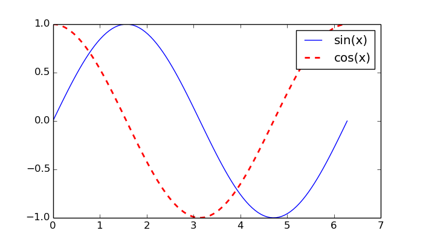

## Motivation 

I often use Python and [matplotlib](http://matplotlib.org/) for
exploring measurement data (from e.g. accelerometers), even if I use R for
the actual analysis. The reason is that I like to be able to flexibly zoom
into different parts of the plot using the mouse and this works well for me
with matplotlib. So I decided to try to call matplotlib from R using Rcpp and
[Python/C API](https://docs.python.org/2/c-api/).

It was surprisingly simple to get it working and I put together a small
R-package [Rpyplot](https://github.com/mpastell/Rpyplot). The package seems
to work well on Ubuntu and Windows 7 for my use cases.

A lot of the code is based on the informative [Call Python from R through
Rcpp](http://gallery.rcpp.org/articles/rcpp-python/) post in Rcpp gallery. I
decided not use Boost.Python to make compiling on Windows simpler.

This post explains how I implemented the package and hopefully it will also
allow others to expand the package for their needs. If you do implement
additional functionality for Rpyplot I'd appreaciate a pull request on
Github.

## Set up
 
You'll need to have Python in your path and Python headers and matplotlib
installed (id `sudo apt-get install python-dev python-matplotlib` in
Ubuntu). In Windows I have used the
[Anaconda](https://store.continuum.io/cshop/anaconda/) Python distribution.

The following sets the compiler flags for Ubuntu:


py_cflags <- system("python2.7-config --cflags", intern=TRUE)
Sys.setenv("PKG_CXXFLAGS"=sprintf("%s %s", Sys.getenv("PKG_CXXFLAGS"), py_cflags))
py_ldflags <- system("python2.7-config --ldflags", intern=TRUE)
Sys.setenv("PKG_LIBS"=sprintf("%s", py_ldflags))


You can have a look at the Makevars.win in [Rpyplot-package](https://github.com/mpastell/Rpyplot) to see how to set the flags for Windows.

## Calling Python from R

### Initializing

The snippet below contains code required to initialize Python and imports pyplot from matplotlib and `pyrun` function that can be used to call Python from R. All code executed with `pyrun` (or `PyRun_SimpleString` in C++) runs Python source code in the scope of `__main__` module.   


#include <Rcpp.h>
#include <Python.h>
#include <stdlib.h>
#ifndef WIN32
#include <dlfcn.h>
#endif

using namespace Rcpp;

//Run Python commands from R
//[[Rcpp::export]]
void pyrun(std::string command) {
    PyRun_SimpleString(command.c_str());
}

//You need to call this first
//[[Rcpp::export]]
void initialize_python() {
#ifndef WIN32
   dlopen("libpython2.7.so", RTLD_LAZY |RTLD_GLOBAL); //Required to import matplotlib
#endif
    Py_Initialize();
    pyrun("import matplotlib");
    //pyrun("matplotlib.use('Qt4Agg')");
    pyrun("import matplotlib.pyplot as plt");
}

//Call after you're done
//[[Rcpp::export]]
void finalize_python() {
    Py_Finalize();
}


### Copying data

It is not enough to be able to just run Python commands from strings, but we also need to pass data from R to Python. The `numvec_to_python` function below copies a numeric vector from R to a Python list and adds it to Python's `__main__` module. It is then accessible to Python commands executed with `pyrun`.


#include <Rcpp.h>
#include <Python.h>
#include <stdlib.h>n
using namespace Rcpp;

//Convert NumericVector to Python List
PyObject* numvec_to_list(NumericVector x) {
    int n = x.length();
    PyObject *xpy = PyList_New(n); //Make new list
    PyObject *f;
    
    for (int i=0; i<n; i++) {
      f = PyFloat_FromDouble(x[i]);
      PyList_SetItem(xpy, i, f); //Fill list from NumericVector
    }   
    return(xpy);
}

//Copy a numeric vector from R to Python
//[[Rcpp::export]]
void numvec_to_python(std::string name, NumericVector x) {
    PyObject *xpy = numvec_to_list(x);
    PyObject *m = PyImport_AddModule("__main__");
    PyObject *main = PyModule_GetDict(m); //Get the locals dictionary of __main__ module
    PyDict_SetItemString(main, name.c_str(), xpy); //Add variable to that dictionary
}



### Plotting

Using the functions defined above makes calling matplotlib simple. First you
will need to copy a vector to Python and then you are able to plot it running
Python commands using `pyrun`. You can see how different plots are created in
Rpyplot by looking at [Plot.R](
https://github.com/mpastell/Rpyplot/blob/master/R/plot.R). The implemenation
of `pycontourf` function also shows how to copy an R matrix to Python and
convert it to a NumPy array.

Here is a small example on how the above functions can be used to create two
line plots. You'll need to call `plt.show()` in order to open the plot, but
when you do the program will hang until all opened figure windows are closed
so make sure to only call it at the end of a script.


x <- seq(0, 2*pi, length = 100)
sx <- sin(x)
cx <- cos(x)

initialize_python()
#Copy variables to Python
numvec_to_python("x", x) 
numvec_to_python("sx", sx)
numvec_to_python("cx", cx)
#Set plot size
pyrun("plt.rcParams.update({'figure.figsize' : (7,4)})") 
#Create plots
pyrun("plt.plot(x, sx)")
pyrun("plt.plot(x, cx, '--r', linewidth=2) ")
pyrun("plt.legend(('sin(x)', 'cos(x)'))")
pyrun("plt.savefig('../figure/2015-04-02-pyplot.png')")
#pyrun("plt.show()") #Uncomment this line to show the plot

And here is the generated plot:

