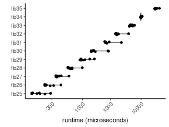
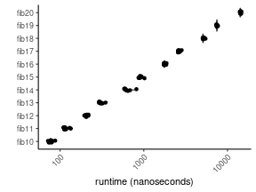

Rcpp is all about the need for speed. However, Rcpp code is not magically fast, but is the result of careful coding and profiling. `RcppClock` makes it easy to profile C++ code from R:

* On the C++ side, `RcppClock` wraps `std::chrono::high_resolution_clock` (C++11) to time chunks of code, and exports the results to an R object in the global environment.
* On the R side, `RcppClock` provides convenient methods for summarizing results and plotting with `ggplot2`.

There are other Rcpp benchmarking tools, such as the Rcpp `timer` class (see RcppGallery vignettte [here](https://gallery.rcpp.org/articles/using-the-rcpp-timer/)) and `rcppgeiger` (see repo [here](https://github.com/eddelbuettel/rcppgeiger
)). `RcppClock` moves beyond both of these tools by supporting overlapping time points and direct access to timing results in the R environment.

By benchmarking Rcpp code with `RcppClock`, we avoid measuring latency associated with converting R types to C++ types (and back again), and we can profile at line-by-line resolution rather than entire functions.

Note: `RcppClock` is not compatible with OpenMP parallelization, and does not accurately measure processes taking less than ~1 microsecond (somewhat implementation-dependent).

## A simple example

Install `RcppClock` from CRAN:


install.packages("RcppClock")


In your `.cpp` file, link the `RcppClock` header with `//[[Rcpp::depends(RcppClock)]]` and, if this is an R package, link to it in your `DESCRIPTION` file. `RcppClock` loads `Rcpp.h` so we don't need to include it again.


//[[Rcpp::depends(RcppClock)]]
#include <RcppClock.h>
#include <thread>

//[[Rcpp::export]]
void sleepy(){
  Rcpp::Clock clock;
  
  clock.tick("both_naps");
  
  clock.tick("short_nap");
  std::this_thread::sleep_for(std::chrono::milliseconds(10));  
  clock.tock("short_nap");
  
  clock.tick("long_nap");
  std::this_thread::sleep_for(std::chrono::milliseconds(100));  
  clock.tock("long_nap");

  clock.tock("both_naps");
  
  // send the times to the R global environment variable, named "naptimes"
  clock.stop("naptimes");
}


`.tick(std::string)` starts a new timer. Provide a name to record what is being timed.

`.tock(std::string)` stops a timer. It is important to use the same name as declared in .tick().

`.stop(std::string)` calculates the duration between all .tick() and .tock() timing results, and creates an object in the R environment with the name provided.

On the R end, we can now summarize the results using the "naptimes" variable that was created in the above Rcpp function:


sleepy()
# global variable "naptimes" is now created in the environment
library(RcppClock)
naptimes


<pre class="output">
Unit: milliseconds 
    ticker   mean sd    min    max neval
 both_naps 110.19 NA 110.19 110.19     1
  long_nap 100.10 NA 100.10 100.10     1
 short_nap  10.09 NA  10.09  10.09     1
</pre>

## Multiple replicates

For extremely fast calculations it can be useful to repeat the calculation some number of times in order to improve the accuracy of the measurement.

If a `.tick()` with the same name is called multiple times, `RcppClock` automatically groups the results.

The following code reproduces the `?fibonacci` function example included in the `RcppClock` package:


int fib(int n) {
  return ((n <= 1) ? n : fib(n - 1) + fib(n - 2));
}

//[[Rcpp::export]]
void fibonacci(std::vector<int> n, int reps) {
  Rcpp::Clock clock;
  
  while(reps-- > 0){
    for(auto number : n){
      clock.tick("fib" + std::to_string(number));
      fib(number);
      clock.tock("fib" + std::to_string(number));
    }
  }
  clock.stop("clock");
}


On the R end, we will get an object named "clock":


fibonacci(n = 25:35, reps = 10)
# global variable "clock" is created in the R global environment
clock


<pre class="output">
Unit: milliseconds 
 ticker    mean      sd     min     max neval
  fib25  0.1734 0.04975  0.1354  0.2845    10
  fib26  0.2651 0.06472  0.2263  0.4273    10
  fib27  0.3932 0.07265  0.3493  0.5869    10
  fib28  0.6463 0.12682  0.5626  0.9919    10
  fib29  1.0641 0.22482  0.8996  1.5922    10
  fib30  1.7432 0.53559  1.3993  2.7752    10
  fib31  2.7441 0.67205  2.4041  4.6192    10
  fib32  4.0757 0.73495  3.6354  6.1233    10
  fib33  6.8620 0.49135  6.2664  7.7575    10
  fib34 10.0244 0.22531  9.7690 10.4643    10
  fib35 17.9276 1.05583 17.1352 20.5875    10
</pre>

The result of `summary()` is an S3 object of class `RcppClock` (essentially a `data.frame`) and has a `plot` method using `ggplot2`:


plot(clock)


Unfortunately, some times were nearly impossible to measure. We can fix this by replicating the calculation many times within each timing bracket:


//[[Rcpp::export]]
void fibonacci_rep(std::vector<int> n, int outer_reps, int inner_reps) {
  Rcpp::Clock clock;
  
  while(outer_reps-- > 0){
    for(auto number : n){
      clock.tick("fib" + std::to_string(number));
      for(int rep = 0; rep < inner_reps; ++rep)
        fib(number);
      clock.tock("fib" + std::to_string(number));
    }
  }
  clock.stop("clock");
}


Now on the R end we can account for this:


fibonacci_rep(n = 10:20, outer_reps = 10, inner_reps = 10000)
clock$timer <- clock$timer / 10000
clock


<pre class="output">
Unit: nanoseconds 
 ticker     mean      sd      min      max neval
  fib10    77.66   4.469    71.67    87.31    10
  fib11   116.92   8.336   109.19   133.93    10
  fib12   206.95   7.735   194.62   218.52    10
  fib13   306.46  18.058   290.51   349.29    10
  fib14   637.75  69.371   582.90   815.85    10
  fib15   909.88  45.979   864.89  1020.59    10
  fib16  1782.64  45.661  1735.67  1866.92    10
  fib17  2642.99  84.156  2562.64  2832.20    10
  fib18  5170.67 126.798  5063.44  5456.16    10
  fib19  7485.84 107.298  7319.87  7685.55    10
  fib20 14326.20 214.079 14063.28 14684.91    10
</pre>

And plot the results:


plot(clock)


In conclusion, `RcppClock` is a non-intrusive method for benchmarking Rcpp code in R.
